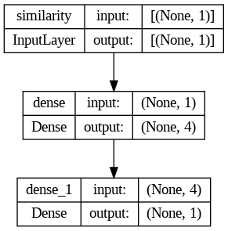
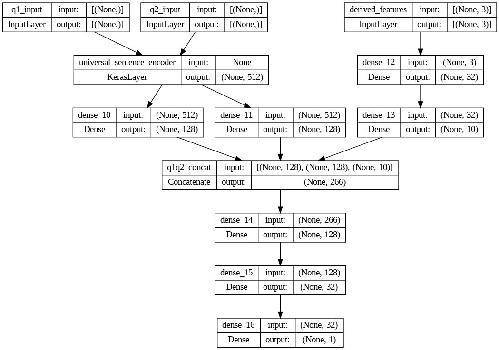
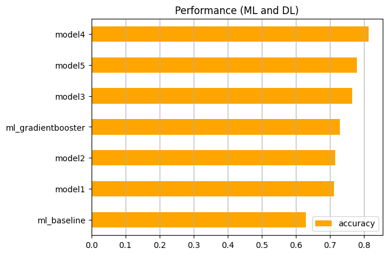

# Detecting Duplicate Quora Questions with Natural Language Processing & Deep Learning

The purpose of this project is to identify duplicate questions on Quora.com. A dataset of over 400K labelled pairs of questions was provided and the objective was to build a Binary Classifer that would correctly classify each pair as duplicates of each other or not. This is an NLP problem and an opportunity to showcase Deep Learning skills.

## Process

1. Preprocessing the data - removing punctuation, lemming, tokenizing, etc.
2. Feature generation - creating discerning features that will act as input to the classifier model.
3. Model building - step-wise production of deep learning models of increasing complexity.

## Feature Engineering 
### `cosine_distance` feature

Doc2Vec by Gensim was the basis of this feature. Similar to Word2Vec, this package maps the semantic relationship between longer text. It was trained on the dataset, used to vectorize the text, and SkLearn's `pairwise.cosine.singularity` function was applied to these vectors to generate `cosine_distance`.

### `similarity` feature
Tensorflow Hub's Universal Sentence Encoder was used to generate this feature. It is the semantic distance between two embedded texts, got from applying `np.inner` function. USE has numerous applications and was used in this project as both a feature generator, and an embedding layer.
 

## Modelling 
### Machine Learning
A `LogisticRegression` model was used as the baseline and gave an accuracy score of 0.63. A non-rigorous `GridSearch` was 'won' the `GradientBoostingClassifier` at `max_depth` = 5 and a score of 0.73.

**Update**: At a later time, the experiment was repeated with a smaller subset. The XGBoostClassifier with default parameters won with a score of 0.83. However it is hard to conclude how it would have performed under the same conditions as the original GridSearch. It is included for completeness.

### Deep Learning
The strategy was to start with a simple 3-layer, 4-hidden node model and add complexity as required.

Model 1

Model 4

## Results
The best performance was from Model 4 shown above, with a testing score of 0.84. Models 1 & 2 performed at the same level as the Machine Learning models. Model 3 overfitted with a Training score of almost 0.94 and a testing score of <0.75

 

## Challenges
* Mislabelled data. 
* Unbalanced classes.
* Computationally expensive exercise, even running on Google Colab. 

## Further Work/ Recommendations
* Use an LSTM/RNN model.
* Use an Active Learning strategy.

The labeled dataset can be downloaded from [here](https://drive.google.com/file/d/19iWVGLBi7edqybybam56bt2Zy7vpf1Xc/view?usp=sharing).
